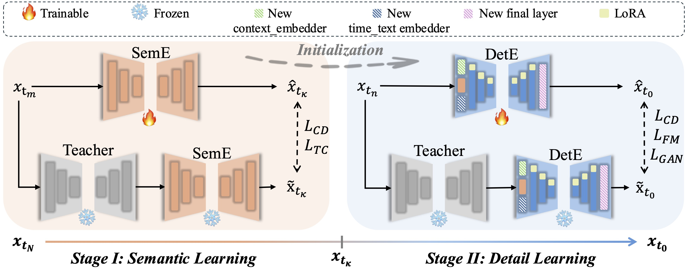

<div align="center">
<h1>Dual-Expert Consistency Model for Efficient and High-Quality Video Generation
</h1></div>


<div align="center">
    <a href="https://scholar.google.com/citations?user=FkkaUgwAAAAJ&hl=en" target="_blank">Zhengyao Lv</a><sup>2,3*</sup> |
    <a href="https://chenyangsi.github.io/" target="_blank">Chenyang Si</a><sup>1*</sup> |
    <a href="https://tianlinn.com/" target="_blank">Tianlin Pan</a><sup>1,4</sup> |
    <a href="https://frozenburning.github.io/" target="_blank">Zhaoxi Chen</a><sup>5</sup> |
    <a href="https://i.cs.hku.hk/~kykwong/" target="_blank">Kwan-Yee K. Wong</a><sup>2</sup> |
    <a href="https://mmlab.siat.ac.cn/yuqiao/" target="_blank">Yu Qiao</a><sup>3</sup>    |
    <a href="https://liuziwei7.github.io/" target="_blank">Ziwei Liu</a><sup>5†</sup>
</div>
<div align="center">
     <sup>1</sup> Nanjing University &nbsp;&nbsp;&nbsp;&nbsp;&nbsp; 
    <sup>2</sup>The University of Hong Kong &nbsp;&nbsp;&nbsp;&nbsp;&nbsp; 
    <sup>3</sup>Shanghai Artificial Intelligence Laboratory <br>
    <sup>4</sup>University of Chinese Academy of Sciences
    <sup>5</sup> S-Lab, Nanyang Technological University
</div>

<div align="center">(*: Equal contribution; †: Corresponding authors)</div>

<p align="center">
    <a href="https://arxiv.org/pdf/2506.03123">Paper</a> | 
    <a href="https://vchitect.github.io/DCM/">Project Page</a>
</p>


# 🗓️Release

[2025/06/04] 🔥 We released the train and inference code of DCM.

# 💡Introduction

Diffusion Models have achieved remarkable results in video synthesis but require iterative denoising steps, leading to substantial computational overhead. Consistency Models have made significant progress in accelerating diffusion models. However, directly applying them to video diffusion models often results in severe degradation of temporal consistency and appearance details. In this paper, by analyzing the training dynamics of Consistency Models, we identify a key conflicting learning dynamics during the distillation process: there is a significant discrepancy in the optimization gradients and loss contributions across different timesteps. This discrepancy prevents the distilled student model from achieving an optimal state, leading to compromised temporal consistency and degraded appearance details. 

To address this issue, we propose a parameter-efficient **Dual-Expert Consistency Model (DCM)**, where a semantic expert focuses on learning semantic layout and motion, while a detail expert specializes in fine detail refinement. Furthermore, we introduce Temporal Coherence Loss to improve motion consistency for the semantic expert and apply GAN and Feature Matching Loss to enhance the synthesis quality of the detail expert. Our approach achieves state-of-the-art visual quality with significantly reduced sampling steps, demonstrating the effectiveness of expert specialization in video diffusion model distillation. For more details and visual results, go checkout our [Project Page](https://vchitect.github.io/DCM/).



# 🔧 Usage

## 🚀 Installation

Run the following instructions to create an Anaconda environment.

```shell
conda create -n dcm python=3.10.0
conda activate dcm
git clone https://github.com/Vchitect/DCM
cd DCM
pip install torch==2.5.0 torchvision==0.20.0 torchaudio==2.5.0 --index-url https://download.pytorch.org/whl/cu121
pip install -e .
pip install flash-attn --no-build-isolation
```

## 🚀 Inference

First download the checkpoints from [DCM](https://huggingface.co/cszy98/DCM) and put the checkpoints into `ckpt` . And then, run the following command to perform inference.

Note:  Before running the script, the relevant parameters and path configurations need to be modified accordingly.

```shell
# For HunyuanVideo
scripts/inference/inference_hy.sh
# For WAN2.1
scripts/inference/inference_wan.sh
```


## 🚀 Distillation

### 👉 HunyuanVideo

#### [Preparation]

**Data Preparation**	 For the distillation of HunyuanVideo, we utilize the [FastVideo](https://github.com/hao-ai-lab/FastVideo?tab=readme-ov-file)-preprocessed dataset [**HD-Mixkit-Finetune-Hunyuan**](https://huggingface.co/datasets/FastVideo/HD-Mixkit-Finetune-Hunyuan/tree/main). Download and p[lace it under the `data` directory. You may also follow the instructions provided [here](https://hao-ai-lab.github.io/FastVideo/training/data_preprocess.html#v0-data-preprocess) to process and utilize your own data.

**Model Initialization**	[HunyuanVideo](https://github.com/Tencent-Hunyuan/HunyuanVideo/blob/main/ckpts/README.md) should be used for initialization in the first-stage semantic expert distillation. Download and place it under the `pretrained` directory. For the second-stage details expert distillation, the semantic expert from the first stage should be used for initialization.

#### [Training]

```shell
# For semantic expert
./scripts/distill/distill_hy_semantic_expert.sh
# For detail expert
./scripts/distill/distill_hy_detail_expert.sh
```

### 👉 WAN2.1

#### [Preparation]

**Data Preparation**	 For the distillation of WAN2.1, we use a self-collected dataset, processed online without pre-encoding into latent representations. The `fastvideo.dataset.t2v_datasets.WANVideoDataset` class can be modified accordingly to accommodate your specific dataset.

**Model Initialization**	[Wan2.1-T2V-1.3B-Diffusers](https://huggingface.co/Wan-AI/Wan2.1-T2V-1.3B-Diffusers) should be used for initialization in the first-stage semantic expert distillation. Download and place it under the `pretrained` directory. For the second-stage details expert distillation, the semantic expert from the first stage should be used for initialization.

#### [Training]

```shell
# For semantic expert
./scripts/distill/distill_wan_semantic_expert.sh
# For detail expert
./scripts/distill/distill_wan_detail_expert.sh
```

# BibTeX

```
@article{lv2025dualexpert,
  author    = {Lv, Zhengyao and Si, Chenyang and Pan, Tianlin and Chen, Zhaoxi and Wong, Kwan-Yee K. and Qiao, Yu and Liu, Ziwei},
  title     = {Dual-Expert Consistency Model for Efficient and High-Quality Video Generation},
  booktitle = {arXiv preprint},
  year      = {2025},
}
```

# Acknowledgement

This repository borrows code from [FastVideo](https://github.com/hao-ai-lab/FastVideo/tree/main). Thanks for their contributions!
